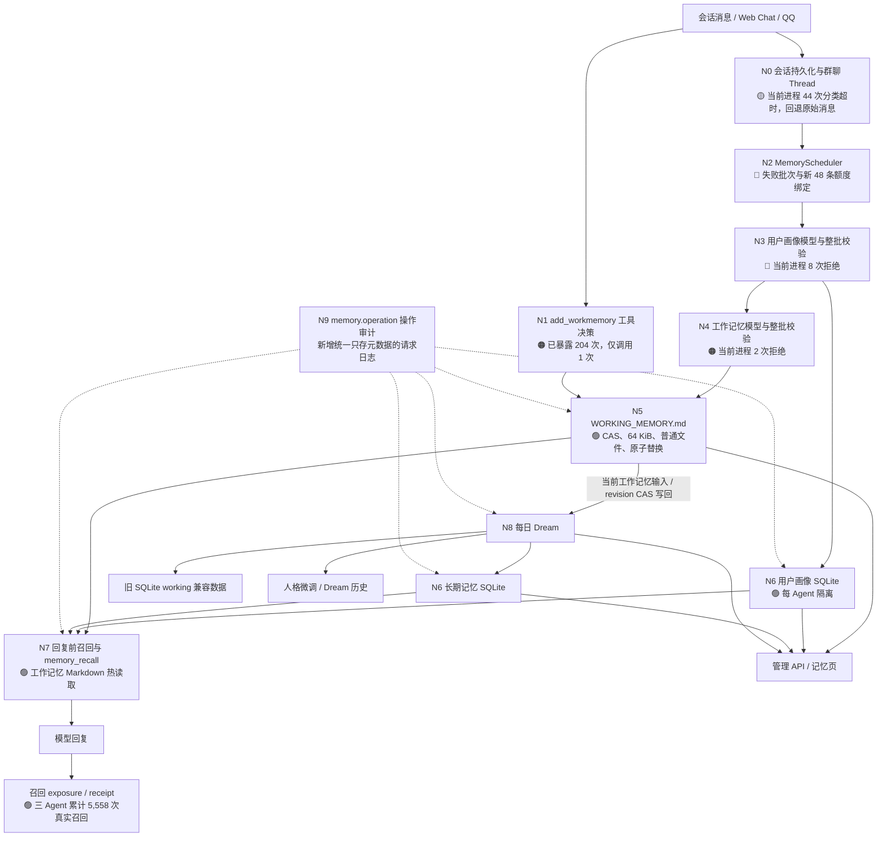

# 记忆系统拓扑与日志审计

日期：2026-07-24
审计时区：Asia/Shanghai
审计范围：Plana、Arona、Koharu 的工作记忆、长期记忆、用户画像、召回、每日 Dream、模型工具、调度器、持久化与请求日志。
运行边界：只读检查现有运行状态、SQLite、`WORKING_MEMORY.md` 和 Core 日志；没有发送真实 QQ 消息或 Provider 请求。

## 1. 结论

当前工作记忆长期为空由两条独立路径共同造成：

1. 普通回复请求已经暴露 `add_workmemory`，但模型很少主动调用。Plana 的 82 次已暴露回复请求中只有 1 次调用成功；Arona 的 122 次已暴露回复请求中没有调用。
2. 自动压缩路径已经达到消息阈值并调用模型，但用户画像先行整批校验频繁失败，工作记忆阶段因此不会执行；少数进入工作记忆阶段的返回也发生整批校验失败。失败批次保留后，调度器要求再新增完整阈值的消息才重试，形成持续积压。

当前 Core 进程自 2026-07-24 16:07:44 +08:00 启动以来，日志中有 10 次整批模型结果拒绝，其中用户画像 8 次、工作记忆 2 次；同一窗口没有 `memory scheduler failed`、`database is not open`、revision 冲突或工作记忆文件安全错误。服务状态为 live、ready、capabilities ready，三个 NapCat 实例均为 running。

因此，当前主要故障位于模型结果到宿主整批校验、失败批次重试策略和 `add_workmemory` 的模型决策三个节点。工作记忆文件路径、普通文件安全、CAS 和原子替换在现有证据中没有出现故障。

## 2. 拓扑与问题标记

标记含义：

- 🔴 高频阻断：已经造成持续积压或记忆不推进。
- 🟠 明显降级：出现多次失败，存在可用回退或旧值保护。
- 🟡 边界或邻接风险：当前按设计隔离，或会降低输入质量但不会直接破坏记忆。
- 🟢 当前健康：有成功记录或当前窗口未发现异常。

## 3. 节点审查

| 节点 | 状态 | 运行与日志证据 | 影响 |
| --- | --- | --- | --- |
| N0 会话输入与 Thread | 🟡 | 当前进程 44 次 `group thread context failed`，保留日志共 754 次；代码明确回退到原始消息 | 不直接阻断记忆，但群聊上下文分类结果缺失会降低模型输入质量 |
| N1 `add_workmemory` | 🟠 | Plana 82 次回复请求暴露工具、1 次成功调用；Arona 122 次暴露、0 次调用；Koharu 在该工具上线后的审计窗口没有回复请求 | 工具端口可用，模型没有主动记录时不会产生工作记忆 |
| N2 自动调度器 | 🔴 | Plana 7 个 queued 会话、1,894 条待处理、失败累计 18；Arona 7 个 queued 会话、3,724 条待处理、失败累计 23；Koharu 7 个 queued 会话、493 条待处理、失败累计 5 | 失败批次继续占用 `currentBatch`，只有 `unattemptedMessageCount >= 48` 才重试；低活跃会话可停留数天，高活跃会话持续积压 |
| N3 用户画像整批校验 | 🔴 | 当前进程 8 次拒绝；可见 `returnedCount > acceptedCount`，包括 3 返回 2 接受仍整批回滚 | 用户画像在工作记忆之前执行，任意画像条目非法都会阻止同批工作记忆 |
| N4 工作记忆模型整批校验 | 🟠 | 当前进程 2 次 `returned=3, accepted=0`；保留日志中共有 4 次新门禁拒绝。历史模型调用还存在较多 transport failure，但最后一次集中发生在旧运行窗口 | 严格门禁正确保留旧 Markdown，同时使本批完全没有进展 |
| N5 Markdown 持久化 | 🟢 | Plana 1 条；Arona 0 条；Koharu 0 条。三份文件均为 0600 普通文件；当前窗口没有路径、符号链接、大小、revision 或原子替换错误 | 文件端没有解释“聊天后仍为空”的证据；Plana 的一次成功证明工具写入链路可用 |
| N6 SQLite 记忆 | 🟢/🟡 | 长期记忆：Plana 534、Arona 209、Koharu 116；用户画像：40、27、13。Koharu 的三类 source revision 都为 0，但已有记录，符合旧数据未触发当前 revision trigger 的形态，需要后续单独核实来源 | 当前读写未见损坏；Koharu revision 异常不应与 Markdown 空白混为同一故障 |
| N7 召回与统计 | 🟢 | 长期记忆召回累计 Plana 1,862、Arona 3,288、Koharu 408；最近一次分别到 2026-07-24 10:28Z、10:25Z 和 2026-07-23 02:15Z | 召回链路持续工作，缺少的是新工作记忆输入 |
| N8 Dream | 🟠/🟡 | 已完成 Plana 3、Arona 2、Koharu 1 次；失败记录中出现旧 response schema 不兼容、`workingReviews[0]` 缺 `confidence` 和 Provider 超时。Plana 还曾因非法长期记忆选择 ID 产生 449 次 tick 失败，集中在 2026-07-20 至 07-21 | Dream 有成功运行，也曾受结构校验阻断；同日代码跟进已改为读取并 CAS 写回当前 Agent Markdown，真实 04:00 运行待验证 |
| N9 操作历史 | 🔴→已补代码 | 现有日志能看到模型请求、召回、Dream 和工具调用，但工作记忆替换、长期记忆 CRUD、用户画像变更、整批拒绝、revision 冲突没有统一事件 | 故障定位需要跨 Core 文本日志和多张表拼接；新增 `memory.operation` 后可按 Agent、来源、操作、结果和原因统一查询 |

## 4. 调度积压快照

审计时最突出的失败批次如下：

| Agent | 会话 | 待处理 | 失败次数 | 新增未尝试消息 | 当前批次开始 |
| --- | --- | ---: | ---: | ---: | --- |
| Plana | `web:admin` | 4 | 8 | 2 | 2026-07-13T12:37:32Z |
| Plana | `group:1030412235` | 892 | 3 | 28 | 2026-07-24T05:54:46Z |
| Plana | `private:171419991` | 301 | 3 | 10 | 2026-07-23T18:59:45Z |
| Arona | `account:qq_5sDFiini-7ce:group:306617576` | 884 | 7 | 20 | 2026-07-24T01:31:50Z |
| Arona | `account:qq_5sDFiini-7ce:group:1023626251` | 407 | 7 | 23 | 2026-07-20T15:54:21Z |
| Arona | `account:qq_5sDFiini-7ce:group:1030412235` | 2,160 | 6 | 0 | 2026-07-23T19:44:43Z |
| Arona | `account:qq_5sDFiini-7ce:private:171419991` | 183 | 3 | 39 | 2026-07-21T16:18:45Z |
| Koharu | `account:qq_wj53GAl5U-CL:group:1030412235` | 271 | 5 | 31 | 2026-07-19T03:46:01Z |

当前规则把失败后的再次尝试也计入“每新增 48 条获得一次尝试”的额度。这个规则控制 Provider 成本，但对确定性的结构校验失败缺少及时恢复能力，也是长期无工作记忆的主要放大器。

## 5. 历史日志与当前窗口

Core 保留日志中出现：

| 事件 | 保留日志总数 | 当前进程数 | 判断 |
| --- | ---: | ---: | --- |
| `rejected incomplete memory model output` | 24 | 10 | 当前主要阻断；20 次用户画像、4 次工作记忆 |
| `work memory compression failed` | 637 | 0 | 历史旧窗口问题，当前进程没有再出现 |
| `user profile compression failed` | 2 | 0 | 历史偶发 |
| `memory scheduler failed: database is not open` | 15 | 0 | 历史进程关闭/切换噪声，当前进程没有出现 |
| `memory batch snapshot conflict` | 0 | 0 | 没有 revision 冲突证据 |
| `group thread context failed` | 754 | 44 | 邻接输入质量问题，运行时继续使用原始消息 |

保留日志没有稳定的进程边界字段用于所有纯文本事件，因此历史总数只用于识别高频区域，不能直接作为失败率。当前进程统计从首条 PID 98082 日志开始，具备明确边界。

## 6. 统一操作日志合同

新增日志复用每个 Agent 现有 SQLite `request_logs`，固定 `category=memory.operation`，不新增 JSON/JSONL 文件，也不推进 schema。每条事件包含：

- 当前 Agent、记忆来源、操作、执行者、结果、稳定原因码和宿主时间；
- 可用的 batch ID、conversation ID/scope、record ID；
- 前后数量、变更数量、前后 revision；
- 不保存记忆正文、模型原始输出、宿主绝对路径或秘密。

覆盖工作记忆追加/替换、长期记忆与用户画像 CRUD、自动批次验证与提交、召回查询、pending exposure、receipt、Dream 阶段。记忆写入成功后若审计追加失败，只输出稳定的 `[memory-audit] append failed`，不回滚已成功的业务写入。

该日志可以直接通过现有请求日志 API 和管理台按 `memory.operation` 搜索。代码落地后首次运行只会记录新操作，不回填历史。

## 7. 后续优先级

1. P1：把自动批次中的用户画像与工作记忆失败结果分别记录为统一 operation，并在管理台用原因码聚合观察。
2. P1：重新设计失败批次重试额度。确定性结构失败需要有界、可观察的修复或重试策略，不能无限依赖再新增 48 条消息。
3. P1：修正用户画像模型输出与宿主称呼/身份门禁的不一致，这是当前工作记忆前置阻断的最高频节点。
4. P2：增强 `add_workmemory` 的提示词使用判断与可观测性，区分“模型认为无需记录”和“遗漏调用”。
5. P2：单独审查 Dream 的 `confidence` 输出一致性和旧非法 selection ID，并在下一次 04:00 验证 Markdown 输入、写回与长期记忆事务。
6. P3：核实 Koharu 旧 SQLite 记录与 source revision 为 0 的来源；在没有写入冲突证据前不做数据修复。

## 8. 验证边界

本次审计确认了当前运行状态、当前/历史 Core 日志、三份 Agent SQLite、三份 `WORKING_MEMORY.md` 和源码控制流。没有用真实聊天触发新的 `add_workmemory`、自动压缩或 Dream，也没有等待下一次 04:00 跨日运行。新增 `memory.operation` 的代码级验证与实际服务部署状态必须分别报告；没有重启前，当前服务不会产生新类别日志。

代码级验证结果：

- `npm run check` 通过。
- 9 个相关测试文件、118 项测试通过，覆盖操作类型、正文不入日志、Agent 隔离、审计失败不回滚、工作记忆文档、宽容追加、整批门禁、调度器与 Dream。
- `npm run runtime:contract` 通过。
- `npm run build` 通过。
- `git diff --check` 通过。
- `npm run architecture` 被当前共享工作区中的文件长度门禁阻断：`adapters/model/provider/toolExecutor.ts` 为 801 行，`adapters/sqlite/applicationDataStore.ts` 为 820 行且类体为 534 行。该失败包含其他并行改动，未通过本次记忆审计扩大范围处理。

## 9. 同日修复跟进

后续实现已经改变两项审计时边界。`add_workmemory` 新增每轮 `working.tool_decision` 操作事件，明确区分 `model_invoked` 与 `model_not_invoked`；工具调用、宿主追加成功和文件失败仍分别保留日志。用户画像历史失败的高频原因确认是宿主固定第一人称句首、称呼来源和称呼—QQ 配对校验，例如 `我把老师（QQ 171419991）……`、`老师（QQ 171419991）是……`；这些正文条件已从宿主写入链路移除，`memory-perspective-v6` 同时把三类记忆提示词中的第一人称、称呼与 QQ 固定格式改为写作建议。

同类核查随后覆盖工作记忆、长期记忆、Dream canonical、Dream 人格微调和离线记忆整理安装器。运行链路不再根据第一人称句首、回忆提示语、认知词、情绪词、称呼、QQ 配对、高风险词、置信度、关系相似性或 token/bigram 来源覆盖率裁决正文；无效可选 QQ 与因果键元数据直接忽略。Dream 重写、合并与转存采用模型返回的非空 canonical 正文，删除和归档仍保留显式保护、召回快照与 0.9 置信度。离线整理器不扫描正文身份或称呼，只保留 Agent、来源行、结构化用户 ID、事件时间、记录结构、签名、恢复点与安装事务条件。跨 Agent 隔离、文件安全、大小、宿主时间、会话绑定与 revision CAS 保持。

`WORKING_MEMORY.md` 也已接入 Dream：每个 Agent 的 Markdown 成为新 Dream 唯一工作记忆输入，revision 随运行输入持久化，Dream 结果通过文件 CAS 写回，旧 SQLite working rows 保留但不再参与选择或替换。长期记忆与 Dream 运行状态继续在 SQLite 事务提交；可观察到的 SQLite 失败会按新 revision 回滚 Markdown，进程在文件提交与 SQLite 提交之间被强制终止仍不具备跨介质原子回滚。上述跟进只有代码级和受控 fixture 证据，尚未经过服务重启后的真实聊天或下一次 04:00 Dream 验证。

实时自动批次的残余整批门禁也已移除。合法 JSON envelope 中夹有空正文时只忽略该条；无法安全绑定当前会话参与者的单条画像只记录原因并跳过，同批其他画像与工作记忆继续提交；合法空工作记忆集合可以直接写成零条，`allPreviousMemoriesInvalidated` 不再参与宿主裁决。顶层模型输出无法解析、当前 Agent/会话无法绑定、文件身份或大小异常、revision 冲突和持久化事务失败仍按技术完整性条件停止写入。

补充代码级验证：18 个记忆与 Dream 测试文件共 204 条用例通过；离线迁移中两条正文、称呼和 QQ 宽容定向用例通过，其余 151 条在该定向命令中跳过。`npm run check`、`npm run runtime:contract`、`npm run build` 与 `git diff --check` 通过。全量迁移单文件运行超过 90 秒且没有继续输出后被终止，不能计为通过。`npm run architecture` 仍被共享工作区既有的三项文件长度超限阻断。
