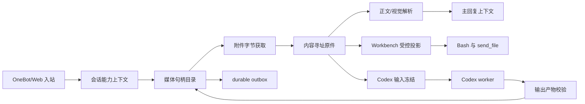

# 会话产物与工具能力架构

## 1. 目标

文件、图片、工作台文件和 Codex 产物应通过同一套会话能力上下文与稳定句柄流转。模型负责表达意图和选择句柄，运行时负责账号路由、字节获取、权限判断、工作台投影、异步冻结和结果回传。

本设计覆盖以下操作：

- 读取当前消息、引用消息和历史消息中的文件或图片。
- 把聊天媒体保存到当前 Agent 的 canonical Workbench。
- 将聊天媒体作为图片生成或 Codex 任务输入。
- 将 Bash 或 Codex 产生的文件作为可校验产物返回原会话。
- 在多 Agent、多 QQ、Native Core 与每账号一个 NapCat Docker 容器下保持相同业务合同。

现行身份鉴权、会话权限、Bash 对抗审批、路径边界、工作台隔离、外发校验和 durable outbox 保持不变。本设计不新增隐式审批、工具互斥、整轮污染标记或失败降级。

## 2. 当前实现与问题

### 2.1 已修复的账号路由

2026-07-30 的 QQ 私聊 PDF 故障发生在附件源查询阶段。原始事件保留了接收账号，附件解析调用却没有携带该账号，OneBot action 因此落到 `primary`。副账号收到的文件无法由主账号查询，`get_private_file_url` 与 `get_file` 均返回文件不存在。

当前修复在附件源端口绑定本轮 `accountId`，当前消息使用入站账号，历史消息补水使用记录所属账号。URL 查询和 Base64 fallback 都使用同一账号，附件服务、缓存和 PDF 解析合同不变。

### 2.2 本轮修复结果与剩余缺口

| 范围 | 当前结果 | 剩余边界 |
| --- | --- | --- |
| 附件定位 | `file_id`、非路径 `file` token、临时 URL、`busid` 与显示名称独立保留；显示名称不再作为下载 token。入站和持久化层都拒绝 URL、绝对路径、反斜杠与控制字符进入 token 字段 | 真实 NapCat 变体仍需现场验收 |
| 获取与解析状态 | 原始字节先形成 acquired blob，再独立记录 `ready`、`partial`、`unsupported` 或 `parse_failed`；解析失败仍可受控导出原件 | 旧失败记录不反推原件存在 |
| Workbench 选择 | 单一会话能力快照始终解析当前 Agent 的 canonical Workbench；管理员私聊、群聊、普通私聊与 Web 管理员会话不选择第二个根 | Voice 仍使用独立系统资产合同 |
| Codex 输入 | `inputHandles` 在 durable dispatch 前冻结；图片使用 Codex 原生图片输入，文本/PDF/Office 使用宿主解析后的有界、只读、哈希绑定文本投影；local worker 同时可读冻结原件 | 无可靠文本投影的非图片二进制只能由 local worker 读取；local worker 当前属于受信任的管理员执行主体，尚未具备抵御恶意附件提示注入后转存自身授权材料的硬隔离 |
| Codex 输出 | CLI worker 与本机 app-server turn 都把当前 lease 对应 `attempt-<n>-<token>/outputs/` 设为 cwd，只接受其中的常规文件，执行路径、链接、大小、哈希和类型复验，再以两阶段发布写入冻结 Workbench；rename 已落盘但响应丢失时按绑定目录与 inode 恢复发布所有权 | SSH app-server 尚无远端文件传输合同；稳定 Codex handle 尚未进入跨后续回合的统一产物目录 |
| 能力可见性 | Bash、聊天媒体、Workbench 文件、会话资产与 Codex dispatch 共用当前会话能力快照；缺少快照时相关端口不进入 Provider catalog | 全部工具的静态目录和管理台可观测性仍属阶段 4 |
| 查询失败证据 | action 账号与有限失败分类已进入现有诊断链，文件 token、临时 URL 与正文不写日志 | 需要真实 QQ 环境补齐路由、过期和权限失败样本 |

当前故障已经由账号路由证据确认。定位信息混合属于独立代码缺口，尚未证明参与了本次故障。

## 3. 核心边界

### 3.1 会话能力上下文

所有会读取、写入、转换或外发产物的工具都接收由运行时创建的不可变上下文：

```ts
interface ConversationCapabilityContextV1 {
  agentId: string;
  accountId: string;
  conversationId: string;
  transport: "onebot" | "web";
  scope: "private" | "user_group" | "bot_group";
  userId: number;
  isAdmin: boolean;
  messageId?: number;
  configEpoch: number;
}
```

`accountId` 决定外部消息系统路由，`agentId` 决定数据与 Workbench 归属，`conversationId` 决定句柄可见范围，`isAdmin` 与 `scope` 只参与既有权限合同。模型参数不能覆盖这些字段。

### 3.2 附件定位与字节获取

入站适配层保留协议提供的全部定位信息：

```ts
interface AttachmentLocatorV1 {
  fileId?: string;
  fileToken?: string;
  temporaryUrl?: string;
  busId?: number;
  groupId?: number;
  displayName: string;
  declaredSizeBytes?: number;
}
```

获取请求由 `ConversationCapabilityContextV1` 和 `AttachmentLocatorV1` 组成。OneBot adapter 按协议能力尝试临时 URL与文件内容 fallback，每次尝试都固定使用接收账号。显示名称只用于界面、扩展名判断和安全文件名，不代替协议定位字段。

获取成功后先产生不可变原件引用：

```ts
interface AttachmentBlobRefV1 {
  cacheKey: string;
  sha256: string;
  sizeBytes: number;
  detectedMimeType?: string;
}
```

解析器消费 `AttachmentBlobRefV1`，并独立产生 `ready`、`partial`、`unsupported` 或 `parse_failed` 结果。原件获取成功时，即使正文解析失败，Bash 或 Codex 仍可在权限允许且重新校验后读取原始字节。

### 3.3 统一会话产物

聊天附件、聊天图片、Workbench 文件、图片生成结果和 Codex 输出统一投影为：

```ts
interface ConversationArtifactRefV1 {
  handle: string;
  agentId: string;
  conversationId: string;
  kind: "file" | "image";
  origin: "chat" | "workbench" | "image_generation" | "codex";
  sha256: string;
  sizeBytes: number;
  mimeType?: string;
  displayName: string;
  storage: {
    backend: "cache" | "workbench" | "conversation_archive";
    rootIdentity: string;
    relativePath: string;
  };
}
```

句柄是模型与会话历史中的稳定引用。路径只在受控 adapter 内解析，Provider 提示词、SQLite 会话正文和跨组件协议不保存宿主绝对路径、临时 URL 或 Base64。

### 3.4 Workbench 路由

建立唯一的 `resolveConversationWorkbench(context, purpose)`：

- 管理员私聊、管理员群聊、普通私聊、普通群聊与 Web 管理员会话都解析当前 Agent 的 canonical `workbench/`。
- macOS Host Bash 与 Linux/WSL Bubblewrap 只是在不同平台把同一根以获准形态暴露给 Native 工具，不产生第二个业务目录。
- `export_chat_media`、Bash、Codex 输入准备、`send_file` 和 durable asset 都调用同一解析器。
- v0.2 的 `docker-workbench/` 只作为 0.2→0.3 停服迁移输入；运行时、管理 API、管理台和新用例不读取或创建该目录。

返回值包含 canonical 根身份、可读写模式和安全相对路径规则。工具描述从同一结果生成，避免描述与执行分离。

### 3.5 Codex 输入与输出

Codex 输入增加可选会话产物句柄：

```ts
interface CodexTaskInputV2 {
  task: string;
  kind: "local" | "research" | "analysis";
  inputHandles?: string[];
}
```

当 macOS Native 管理员私聊或已认证管理员 Web Chat 同时符合 app-server control 条件时，当前或引用消息只要形成了可冻结媒体目录，本轮同名 `codex` 仍使用 worker schema，保留 required nullable `inputHandles` 与 deferred dispatch，并且不附加内部 control 授权标记。control schema 只用于没有媒体输入的合格回合，不能覆盖附件冻结链。

运行时在异步派发前完成以下动作：

1. 在当前会话和捕获序列内解析句柄。
2. 校验原件身份、大小、类型与当前权限。
3. 将只读副本冻结到 worker 可见的受控输入目录。
4. 在 durable payload 中只保存稳定身份、相对路径和哈希。

Codex 结果增加 `artifacts`：

```ts
interface CodexResultArtifactV1 {
  relativePath: string;
  displayName: string;
  sha256: string;
  sizeBytes: number;
  mimeType?: string;
}
```

CLI worker 与本机 app-server turn 的 cwd 都是当前 attempt 隔离输出目录。`local` 项目目录只作为单独 writable root，源代码修改可留在项目目录，需要回传的文件必须在 cwd 中以相对路径创建并声明。宿主逐个执行根身份、路径、符号链接、大小、哈希与 MIME 校验，随后生成 `ConversationArtifactRefV1`。模型可继续分析正文，也可通过现有 durable 会话资产链路把产物发送给原会话。SSH app-server 没有远端文件传输合同，只允许文本结果与远端项目修改。

没有媒体输入的本机 control `start` 或 `resume` 可以把 `workspace_path` 传为 `null`，解析器只从 durable tool job 的运行时上下文取得既有受信项目 workspace。SSH `start` 或 `resume` 仍必须显式提供远端绝对路径，不能借用本机上下文路径。

`analysis` 与 `research` 只读取宿主生成的受控文本投影，并关闭 shell 与 unified exec。`local` worker 可以读取冻结原件，也需要使用 attempt 内的隔离 Codex home 完成认证；因此它当前是管理员授权的受信任执行主体。输出目录白名单、哈希复验和路径脱敏可以阻止直接声明 `codex-home/auth.json`，无法阻止已取得本地执行能力的模型把授权内容改写后放入合法输出目录。若未来需要把 `local` worker 降为不受信任主体，必须增加短期凭据代理或进程外认证通道，并为附件分析提供独立的只读能力沙箱。

## 4. 运行流程



## 5. 分阶段实施

### 阶段 0：账号路由修复

状态：本次任务已实现。

- 附件解析请求携带 `accountId`。
- 当前消息和历史消息都绑定所属账号。
- `get_private_file_url`、`get_group_file_url` 与 `get_file` fallback 保持同账号。
- 使用副账号原始私聊 PDF 事件做隔离 user test。

### 阶段 1：附件获取与解析解耦

状态：本次任务已实现。

- 保留 `file_id`、`file`、URL、`busid` 和显示名称的独立字段。
- 引入 acquired/parse 双状态与 `AttachmentBlobRefV1`。
- 获取成功且解析失败的原件仍可通过受控句柄导出。
- 日志记录每次 action 的账号、动作、retcode、耗时与有限错误分类，不记录文件 ID、临时 URL 或文件正文。

验收必须覆盖私聊和群聊、显式 `file_id`、仅 `file` token、URL 为空后 Base64 fallback、过期文件、解析失败但原件可导出，以及 Linux/WSL Native Core 与每账号 NapCat Docker。

### 阶段 2：统一会话能力与 Workbench 路由

状态：本次任务已实现。

- 引入 `ConversationCapabilityContextV1`。
- 收敛聊天媒体、Bash、Codex、`send_file` 和 durable asset 的 Workbench 选择。
- 工具目录从同一能力快照生成，并在配置 epoch 或会话失效后停止执行。
- 保留现有权限和审批行为。

验收必须覆盖四种主对话角色、Web 管理员会话、单一 canonical Workbench、macOS Host 与 Linux/WSL Bubblewrap 投影、工具可见性与实际执行一致、跨 Agent/跨会话句柄拒绝。

### 阶段 3：Codex 会话产物桥

状态：本次任务已实现输入冻结、文本投影、图片输入、CLI 与本机 app-server 的 cwd 输出合同、输出校验、两阶段 Workbench 发布和当前完成回调中的 `send_file` 闭环。SSH 文件传输与跨后续回合的统一产物目录留在阶段 4。

- 增加 `inputHandles`，在派发前冻结只读输入。
- 增加 Codex `artifacts`，校验后注册为会话产物。
- 将每次本机 Codex turn 的 cwd 固定为 attempt 输出目录，项目目录只作为独立授权根。
- 将产物接入既有 durable outbox 和 `send_file`。
- Codex 超时、重试、恢复和继续线程都复用冻结输入身份。

验收必须覆盖 PDF 分析、图片分析、多个输入、输出文件回传、输出目录穿越、符号链接、结果篡改、任务恢复、配置 epoch 漂移和零伪成功外发。

### 阶段 4：能力目录与可观测性收敛

状态：未完成。当前只完成会话产物相关端口的单一 capability snapshot 与 fail-closed wiring。

- ToolRegistry 只描述静态工具合同。
- 运行时为每轮生成单一 capability snapshot。
- Provider catalog、executor、异步派发和审计日志使用同一 snapshot。
- 管理台按账号、会话、产物和动作展示有界失败分类。

验收必须证明 Provider 可见工具均可在本轮执行，运行时拒绝的能力不会继续留在 catalog，错误证据足以区分路由、获取、解析、投影、worker 和外发阶段。

## 6. 兼容与迁移

- 保留现有 `message:<message-id>:image:<index>` 和 `message:<message-id>:file:<index>` 句柄。
- 阶段 0 不修改 SQLite schema、附件 manifest 或 durable payload。
- acquired/parse 双状态需要向前迁移，旧 `ready`/`partial` 映射为获取与解析均成功，旧 `failed` 保持失败且不推测原件存在。
- 新 Codex 输入和产物字段均为可选；旧任务没有产物声明时继续按原合同执行，出现新产物声明但缺少冻结 canonical Workbench 标记时以 `codex_artifact_backend_missing` 明确失败，不能静默丢弃文件。该稳定错误名不代表存在第二个运行 backend。
- 任何 durable schema 升级都使用 exact-key decoder、显式版本和恢复测试，不能依赖删除数据库或任务重建。

## 7. 完成标准

- 任一 QQ 账号收到的文件只通过该账号查询和下载。
- 获取成功的原件具有稳定内容身份，解析失败不会抹去原件可用性。
- 同一会话中的文件、图片、Bash 文件与 Codex 产物都能通过稳定句柄组合使用。
- 模型无需猜测宿主路径、容器路径、临时 URL 或异步 worker 目录。
- 工具可见性、执行能力、Workbench 路由和外发能力来自同一会话快照。
- Linux/WSL Native Core + 每账号 NapCat Docker 在 amd64/arm64 使用同一业务合同，并通过独立真实环境验收；macOS 源码形态保持同一数据与会话合同。
