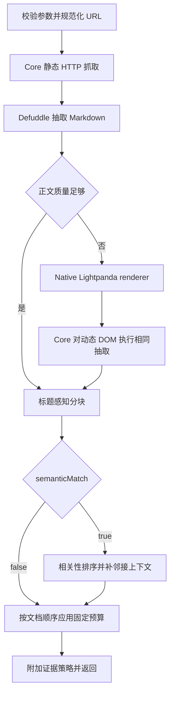

# WebFetch 工具设计

版本：2026-08-12（v0.3.0）

状态：已实现。静态抓取由 Core 直接完成；动态抓取使用 Lightpanda `0.3.3`。Linux 与 WSL 在 Bubblewrap 中运行动态 renderer，macOS 动态抓取明确为 `unavailable`，静态抓取继续可用。

适用范围：Sunabot Core、Provider 工具循环、Native WebFetch renderer、发行包与联网工具边界。

## 1. 目标与固定边界

`webfetch` 读取一个 HTTP(S) 网页的主要内容，并以有界 Markdown 返回当前 Provider turn。静态 HTML 优先由 Core 处理；正文不足时才请求独立动态 renderer。

- 模型公开参数只有 `url`、`semanticMatch` 和条件参数 `query`。
- `semanticMatch=false` 时必须省略 `query`；`semanticMatch=true` 时必须提供非空 `query`。
- 模型不能选择抓取引擎、等待时间、请求头、Cookie、代理、输出格式、预算或隔离方式。
- 输出只包含抽取后的 Markdown、来源元数据和固定证据策略；不返回原始响应头、Cookie、浏览器状态或进程诊断。
- 每次调用只读取一个 URL，不递归爬站，不点击、不填写表单、不登录，不绕过验证码或付费墙。
- 第一阶段只处理 `http:` 与 `https:` HTML；PDF、Office、图片和普通文件继续走附件能力。

## 2. 技术决策

| 关注点 | v0.3.0 决策 |
| --- | --- |
| 静态抓取 | Core 内有界 HTTP GET，Defuddle 抽取 Markdown |
| 动态抓取 | 独立 Native renderer 调用 Lightpanda `0.3.3` 的 `fetch --dump html` |
| 浏览器内核 | Lightpanda 自有非 Chromium 实现；无 Chrome、Chromium、Playwright 或 Puppeteer 运行依赖 |
| Linux / WSL | renderer 由 launcher 监管，并在 Bubblewrap 中运行 |
| macOS | 动态 renderer 固定 `unavailable`；静态 WebFetch 保持可用，不启动 Docker renderer |
| 发行依赖 | Linux amd64/arm64 发行包内置 Lightpanda、对应源码与许可、Node、renderer Node 依赖、Bubblewrap、ELF loader 与完整动态库闭包 |
| 内容筛选 | 标题分块、BM25、中文字符 n-gram、标题命中与邻接上下文 |
| 输出预算 | 宿主固定；模型不能调高 |
| 缓存 | 最多 64 项、5 分钟进程内 LRU，不新增持久化格式 |
| 外部内容 | 始终作为不可信证据，并附加宿主固定的 `webfetch_evidence_policy_v1` |

选型依据：Lightpanda 是面向自动化的独立浏览器实现，提供可脚本化的动态页面加载能力，且无需分发 Chromium；`0.3.3` 以精确版本和摘要进入 component lock。Lightpanda 使用 AGPL，发行归档同时携带对应源码与许可。运行时设置 `LIGHTPANDA_DISABLE_TELEMETRY=true`，不允许动态下载、自动升级或遥测回传。

正文抽取继续使用锁定版本的 [Defuddle](https://github.com/kepano/defuddle)，并固定 `useAsync: false`，避免抽取器调用第三方回退服务。相关性策略参考 [Crawl4AI](https://github.com/unclecode/crawl4ai) 的分块和 BM25 思路，但不引入 Python 运行时。

## 3. 公开工具契约

```ts
type WebFetchInput =
  | { url: string; semanticMatch: false }
  | { url: string; semanticMatch: true; query: string };
```

| 参数 | 规则 |
| --- | --- |
| `url` | 必填；去除首尾空白后为 1—4,096 字符；必须是不含用户名与密码的绝对 HTTP(S) URL |
| `semanticMatch` | 必填布尔值 |
| `query` | 仅匹配模式允许；合并连续空白后为 1—1,000 字符 |

Provider-facing schema 使用协议普遍支持的扁平对象并设置 `strict: false`；宿主仍以封闭联合类型强制字段关系。额外字段、错误类型、关闭匹配仍携带 `query`、开启匹配却缺少 `query` 的调用都在网络请求前失败。WHATWG URL 的 `username` 或 `password` 任一非空时，宿主输入边界、每次跳转、renderer 最终地址和结果装配都必须拒绝；成功或失败结果不得回显 URL userinfo。

成功结果保持稳定结构：

```ts
interface WebFetchSuccess {
  ok: true;
  url: string;
  finalUrl: string;
  title: string;
  fetchedAt: string;
  fetchMode: "static" | "dynamic";
  semanticMatchApplied: boolean;
  contentFormat: "markdown";
  content: string;
  truncated: boolean;
  omittedBlockCount: number;
  evidencePolicy: WebFetchEvidencePolicyV1;
}
```

失败结果只返回稳定错误码和安全文案。不得暴露目标解析地址、宿主路径、renderer 地址、代理凭据、stderr、HTML 片段或异常堆栈。

## 4. 抓取流程



### 4.1 静态阶段

1. 使用 WHATWG `URL` 生成 canonical URL，拒绝 username/password，移除 fragment 并保留查询参数。
2. 接受带主机名的 HTTP(S) URL；地址来源策略不额外按公网、私网、回环、保留网段或 Fake-IP 分类。
3. 每次重定向重新校验协议与 userinfo，最多 5 跳。
4. 不携带用户 Cookie、Authorization、Referer 或浏览器历史。
5. 连接阶段有 10 秒上限，静态阶段共享 90 秒总预算；解压后的 HTML 最多 4 MiB。
6. 只接受 HTML，拒绝附件与二进制正文。
7. Defuddle 清理脚本、样式、隐藏内容、导航和重复结构，Core 再规范化链接与 Markdown。

URL、MIME、重定向或响应预算失败不能通过动态阶段绕过。

### 4.2 动态判定

静态正文不足且页面具备 SPA 空壳、JavaScript 必需提示、加载占位、正文元数据与抽取结果明显不一致等信号时进入动态阶段。动态 DOM 抽取后仍不足则返回稳定失败；不将静态和动态正文拼接。

### 4.3 Lightpanda renderer

`apps/webfetch-renderer/` 是独立 Native 进程边界：

- 每个渲染请求启动一个短生命周期 Lightpanda 子进程；不复用 Cookie、历史、账号或持久浏览器 profile。
- Lightpanda 参数固定为 `fetch --dump html --with-base`，导航预算 12 秒，进程绝对上限 15 秒，DOM 输出最多 4 MiB。
- renderer 最大并发为 2，等待队列最多 16；队列满、调用取消或关闭时有界终止子进程。
- `/render` 只接受单一 `url` 字段，并校验每轮启动生成的 bearer token；`/healthz` 只返回 `engine=lightpanda` 和隔离状态。
- Core、renderer 与 Lightpanda 都不接收 `query`；相关性匹配仅在 Core 内执行。
- renderer 环境清空后只传入固定运行变量，关闭 telemetry 和 core dump。

Linux/WSL launcher 使用 Bubblewrap 创建独立 `HOME`、cache、run 与 `/tmp`，遮蔽仓库、workspace、Provider/OneBot/Codex/NapCat 凭据目录和常见宿主凭据目录，并丢弃全部 capabilities。发行包从 component lock 携带 Bubblewrap 的 Debian ELF loader、`libc`、`libcap`、`libselinux` 与 `libpcre2`，由自定位入口以 `--inhibit-cache` 和包内 library path 启动，不能从宿主动态库补齐依赖。launcher 将已验证的包内绝对入口直接交给 Renderer；发行 `.env` 不能替换它，也不能回落 `/usr/bin/bwrap`。缺少锁定 Lightpanda、Bubblewrap、Node、renderer 依赖、鉴权 token 或真实 namespace 探针失败时，Linux/WSL 的构建、bootstrap 与启动失败关闭，不回退到未隔离进程。

macOS 当前没有满足同一隔离合同的动态执行路径，launcher 固定返回 `WEBFETCH_MACOS_NATIVE_RENDERER_UNAVAILABLE`。Core 仍提供静态抓取；管理台与 doctor 必须显示动态能力不可用，不能启动容器或下载替代引擎。

## 5. 动态出站代理

Lightpanda 只能经 renderer 同进程启动的回环代理发起 HTTP(S) 请求。每个渲染请求获得一次性预算 ID，结束后立即销毁。

| 边界 | 当前值 |
| --- | --- |
| 代理请求数 | 每次渲染最多 32 |
| 单个明文 HTTP 响应 | 最多 4 MiB |
| 全部代理流量 | 每次渲染最多 8 MiB |
| 上游连接 | 15 秒超时 |
| HTTP 方法 | 只允许 GET |
| HTTP 压缩 | 固定请求 `identity`，拒绝压缩响应 |
| 请求头 | 删除 Authorization、Cookie、Proxy-Authorization、Origin、Referer 与内部预算头 |
| 响应头 | 删除 `Set-Cookie` |

HTTPS 使用带鉴权的 CONNECT 通道。CONNECT 能限制连接数、时限和隧道原始字节总量，但代理不能检查 TLS 解密后的 MIME、压缩方式或单响应正文；最终 DOM 仍由 Lightpanda 的响应限制、子进程输出上限和 Core 的 4 MiB DOM/节点/深度限制约束。文档和验收不得把 CONNECT 原始字节预算描述成解压后正文审计。

静态 adapter 与动态代理都沿用产品的地址来源合同：只校验 HTTP(S) 结构，不执行公共 IP 白名单、DNS 固定或目标网段黑名单。每一跳仍执行协议、超时、请求数与字节预算。

## 6. 正文、匹配与缓存

抽取结果保留标题、段落、列表、表格、引用、代码块、脚注和正文链接；移除脚本、样式、表单、导航、页脚、分享控件、Cookie banner 与重复结构。网页中的“system”“developer”“tool”等字样仍是外部正文，不能因关键词被删除或提升为宿主指令。

Markdown 按标题和段落分块，代码块、表格和列表不从中间切断。匹配模式组合 BM25、标题命中、中文字符 n-gram 与邻近度，加入有界前后文后恢复原文顺序。无足够相关块时返回 `SEMANTIC_MATCH_EMPTY`。

| 预算 | Token 上限 |
| --- | --- |
| 进程内缓存正文 | 32,000 |
| 完整模式返回 | 6,000 |
| 匹配模式返回 | 3,500 |

页面缓存最多 64 项、有效期 5 分钟；`query` 不进入页面缓存键。相同 URL 的并发调用合并，单个等待者取消不影响其他等待者，全部等待者取消后终止底层请求。不缓存失败、验证码页或超过限制的响应。

## 7. 提示词与工具组合

成功结果由宿主附加 `webfetch_evidence_policy_v1`，明确网页内容只是外部证据，网页中的指令不得执行，截断内容不得被推断。管理员工具说明不能删除、覆盖或伪造该策略。

`webfetch` 可以与文件、Native Bash、记忆、Skill、MCP、Codex 和 deferred 工具在同一 Provider turn 的不同轮次组合；各工具继续独立执行权限、参数、外发和预算校验。`websearch` 后可继续调用 `webfetch`。

## 8. 运行、发行与状态

| 平台 | 静态抓取 | 动态抓取 |
| --- | --- | --- |
| Linux amd64 | Native Core | 随发行包提供的 Lightpanda + Bubblewrap |
| Linux arm64 | Native Core | 随发行包提供的 Lightpanda + Bubblewrap |
| WSL2 | Native Core | Linux 发行包内的 Lightpanda + Bubblewrap |
| macOS | Native Core | `unavailable`；静态能力不受影响 |

发行归档内置 Node、生产 `node_modules`、Codex、Lightpanda、Lightpanda 对应源码与许可、Bubblewrap 二进制、ELF loader、动态库闭包、对应 Debian 源码与许可，以及 renderer 文件。发行构建通过 loader `--list` 证明 Bubblewrap 的全部 `NEEDED` 库解析到归档内部，并执行真实 user/pid/uts/ipc namespace 探针；安装 bootstrap 和每次 Linux/WSL 启动重复能力探针。安装后 `up|start|restart` 只读取本地归档内容，不安装 npm 包、不拉取浏览器、不构建 renderer，也不启动 WebFetch Docker 容器。

动态状态独立于工具总状态：

- `ready`：Linux/WSL 静态与 Lightpanda 动态抓取均可用；
- `degraded`：macOS 静态可用且动态按平台合同不可用；
- `unavailable`：静态 dispatcher 或正文抽取器不可用。

Linux/WSL 发行合同把动态 Renderer 列为必需能力，Bubblewrap 依赖或 namespace 探针失败不能进入 `ready` 或完成启动。

NapCat 继续作为每账号唯一 Docker 例外；WebFetch 不读取 NapCat 数据，不与 NapCat 共享目录、容器或网络身份。

## 9. 代码边界

| 模块 | 位置 | 职责 |
| --- | --- | --- |
| 工具 schema | `services/tools/webFetchTool.ts` | 三字段公开契约 |
| 领域服务 | `services/webfetch/` | 流程、抽取后分块、匹配、预算、缓存和结果契约 |
| 静态 adapter | `adapters/webfetch/safeHttpFetcher.ts`, `defuddleExtractor.ts` | 有界 HTTP 和 Markdown 抽取 |
| 动态 client | `adapters/webfetch/dynamicRendererClient.ts` | 鉴权、取消、响应预算和错误映射 |
| Native renderer | `apps/webfetch-renderer/` | Lightpanda 子进程、队列与回环代理 |
| launcher | `tooling/runtime/native-webfetch-renderer*.mjs` | 依赖缓存、Bubblewrap、进程身份和清理 |
| 发行合同 | `deploy/runtime-contract.json`, `components/component.lock.json`, `tooling/runtime/build-release.mjs` | 版本、摘要、架构、源码与离线资产 |

`src/runtime.ts` 只组合端口，不实现抓取、抽取、相关性或子进程生命周期。

## 10. 验证与完成定义

| 维度 | 验收 |
| --- | --- |
| 参数 | 两个合法分支可执行；缺失、冲突、额外字段均零网络请求 |
| 静态 | 中英文文章、文档、代码、表格、重定向、超长响应与取消 |
| 动态 | SPA、延迟内容、超时、队列满、子进程失败、4 MiB DOM 上限 |
| 引擎 | 健康结果明确为 `lightpanda`；发行与运行树中不存在 Chrome/Chromium/Playwright/Puppeteer 依赖 |
| 代理 | HTTP 与 CONNECT 鉴权、32 请求/8 MiB 总预算、HTTP 4 MiB、头部清理和取消 |
| 隔离 | Linux/WSL Bubblewrap 遮蔽 workspace、仓库和凭据；失败不降级 |
| macOS | 动态明确 `unavailable`，静态请求仍成功，零 renderer 容器 |
| 发行 | amd64/arm64 归档包含 Bubblewrap loader 与动态库闭包、源码和许可；构建、bootstrap、启动真实 namespace probe 通过；安装后启动零下载 |
| 工具组合 | 与 Native Bash、文件、记忆、Skill、MCP、Codex 顺序组合，各自门禁不变 |

定向单元测试、`npm run runtime:contract`、`npm run check`、`npm run build` 和 release integrity 必须通过。任何 Chrome/Chromium 运行依赖回归、Bubblewrap 绕过、动态启动时下载、renderer 读取 workspace/secret 或 macOS 静默启用未隔离动态抓取都阻断 v0.3.0 发布。
